<p align="center">
  
</p>

<h1 align="center">odrive-linux</h1>

<p align="center">
  A native, opinionated Linux frontend for <a href="https://www.odrive.com">odrive</a>'s on-demand cloud sync — GTK4/Libadwaita Manager, Nautilus and Dolphin integration, an onboarding wizard, a system-tray indicator, and the Rust CLI that drives it all. Wraps the official <code>odriveagent</code>; doesn't replace it.
</p>

> [!NOTE]
>  <br>
> This project voluntarily adheres to The Friendly Manifesto. Read more [here](https://friendlymanifesto.org)

# Features

- **GTK4 / Libadwaita Manager.** Modern Adw shell with a four-tab layout (Mount & Sync, Backup, Encrypt, Trash), a hamburger menu for Preferences and About, and a custom onboarding wizard that walks first-run setup.
- **Onboarding wizard.** Four-phase setup that downloads the official agent, writes the systemd-user unit (so the agent survives reboot), guides you through authenticating, and offers an optional default mount of `~/odrive`. Skip any phase that's already satisfied; pick up where you left off if you close the wizard mid-flow.
- **Nautilus right-click integration** *(GNOME)*. Adds an "Odrive ▸" submenu — Sync, Unsync, Refresh, Share Storage, Copy Share Link, Open Web Preview — plus emblem decorations on synced and syncing entries.
- **Dolphin right-click integration** *(KDE Plasma 6+)*. Native C++/Qt6/KF6 plugins that mirror the Nautilus feature set, including per-file overlay emblems via `KOverlayIconPlugin`.
- **Per-folder sync rules.** Set "auto-download files at or below N MB" on any folder, optionally cascading to its subfolders. Pause and resume rules without losing the threshold; delete to revert to placeholder-only.
- **Backups.** Register one-way local→remote backup jobs that run on the agent's 24-hour schedule (or kick one off immediately).
- **Encryptor folders.** Set the local passphrase for an existing zero-knowledge encrypted folder. (Folder *creation* is a web-only operation; the Manager surfaces a button to jump straight to the odrive web app for that step.)
- **Trash.** List items the agent has trashed. Bulk Restore, bulk Empty, and a per-item Restore that uses a "restore-all-then-redelete-the-rest" workaround to compensate for the absence of a per-item restore in the upstream IPC.
- **Tray indicator.** StatusNotifierItem icon for GNOME (with the AppIndicator extension), KDE, XFCE, and Cinnamon. Open the odrive folder, open the Manager, pause/resume sync, or quit — and the icon animates while transfers are in flight.
- **Full agent preferences.** All four CLI-exposed thresholds plus every file-based agent setting (`odrive_user_general_conf.txt` / `odrive_user_premium_conf.txt`) surfaced in a Settings window, with Status, Logs viewer, and tray-icon-colour picker.
- **Double-click intercept.** Registers MIME types for `*.cloud` / `*.cloudf` so a double-click in any file manager materialises the placeholder and opens the result.
- **One-line installer.** Detects your distro (Debian/Ubuntu vs Fedora/RHEL) and your file manager (Nautilus vs Dolphin), pulls the right `.deb`/`.rpm` packages from the latest GitHub release, and runs `apt`/`dnf` for you.

# Installing

**Recommended — one-line installer:**

```bash
curl -fsSL https://raw.githubusercontent.com/keithvassallomt/odrive-linux/main/install.sh | bash
```

The installer auto-detects:

- Distro family — picks `.deb` for Debian/Ubuntu, `.rpm` for Fedora/RHEL.
- Architecture — `amd64` / `x86_64` (`aarch64`/`arm64` will work once we publish artifacts for those).
- Desktop — `$XDG_CURRENT_DESKTOP` (or installed file managers) decide whether to add the Nautilus subpackage, the Dolphin subpackage, both, or neither.

Re-run the same command to upgrade to the latest release. Useful flags:

| Flag | Purpose |
|---|---|
| `--tag <vX.Y.Z>` | Install a specific release rather than `latest`. |
| `--all` | Install both Nautilus *and* Dolphin integration regardless of the running desktop. |
| `--base-only` | Skip both file-manager integrations; just the Manager + CLI. |
| `--from-dir <path>` | Install from a local directory of `.deb`/`.rpm` files (used for testing builds before tagging). |
| `--dry-run` | Print what *would* run without actually installing. |

**Manual install** — grab the artifacts from the [latest release](https://github.com/keithvassallomt/odrive-linux/releases/latest) and run:

```bash
# Debian / Ubuntu
sudo apt install ./odrive-linux_<ver>_amd64.deb \
                  ./odrive-linux-nautilus_<ver>_all.deb        # GNOME users
sudo apt install ./odrive-linux-dolphin_<ver>_amd64.deb        # KDE users

# Fedora
sudo dnf install ./odrive-linux-<ver>-1.fc41.x86_64.rpm \
                 ./odrive-linux-nautilus-<ver>-1.fc41.noarch.rpm    # GNOME users
sudo dnf install ./odrive-linux-dolphin-<ver>-1.fc41.x86_64.rpm     # KDE users
```

GNOME 46 or later and KDE Plasma 6.0 or later are required.

# Usage

## Onboarding Wizard

The first time you launch `odrive-gui` (or whenever any of the four preconditions stops being satisfied), the onboarding wizard walks you through setup. Each page is gated on a precondition — phases you've already completed are silently skipped.

### 1. Install odrive

<p align="center">
  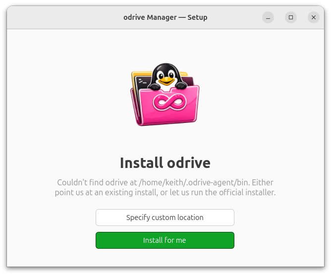
</p>

The wizard checks `~/.odrive-agent/bin/` for the official agent. If it's missing, you've got two options:

- **Install for me** *(recommended)* — runs the official `dl.odrive.com` install pipeline (`curl + tar`) and lays the agent down at `~/.odrive-agent/bin/`.
- **Specify custom location** — point the wizard at an existing install if you've already got the agent somewhere on disk.

### 2. Start the agent

<p align="center">
  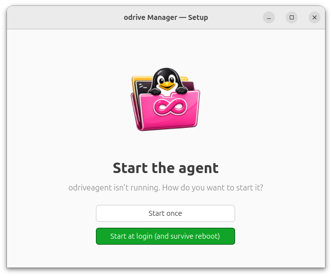
</p>

Once the binaries are present, the wizard offers two ways to bring `odriveagent` up:

- **Start once** — runs the agent for this session only via `nohup`. It dies on logout/reboot.
- **Start at login (and survive reboot)** *(recommended)* — writes a systemd-user unit at `~/.config/systemd/user/odrive.service`, enables and starts it, and turns on user lingering so the agent keeps running even when you're logged out. This is what you almost certainly want.

### 3. Sign in to odrive

<p align="center">
  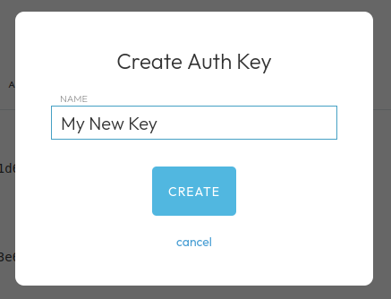
</p>

The agent authenticates via a one-time auth code you generate from the [odrive auth-codes page](https://www.odrive.com/account/authcodes). The wizard's "Get auth code" button opens that page in your browser; create a key, copy the value, paste it into the wizard, and hit "Sign in". The Manager calls `odrive authenticate <code>` under the hood.

### 4. Mount your odrive root

<p align="center">
  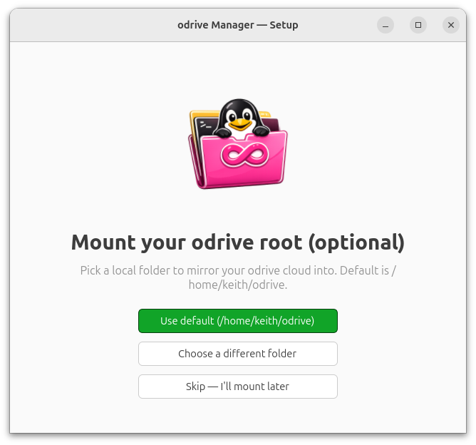
</p>

Optional, but most people want it. Three choices:

- **Use default (`~/odrive`)** — creates the directory and runs `odrive mount ~/odrive /`, mirroring your entire odrive cloud root locally.
- **Choose a different folder** — pick any local folder via a file dialog.
- **Skip** — close the wizard without a mount; the dashboard will show an empty-state with the same "Add mount" affordance whenever you're ready.

After a successful mount you land on the dashboard.

## Syncing Folders & Files

odrive's killer trick is *placeholders*: zero-byte stand-ins for remote files (`.cloud`) and folders (`.cloudf`) that materialise on demand. Right after onboarding, the Manager's Mount & Sync tab looks like this:

<p align="center">
  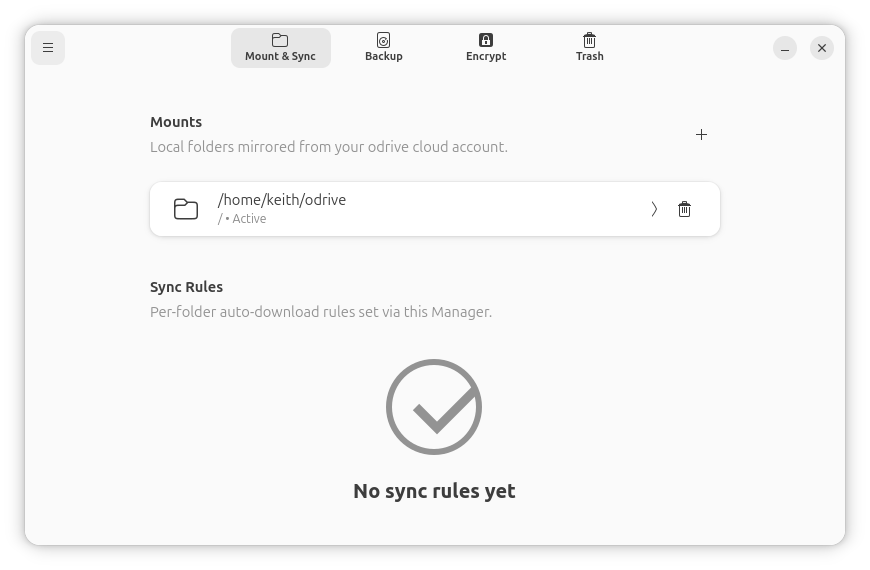
</p>

The mount is registered, but no per-folder sync rules have been set yet. Click the mount row to drill into its tree.

<p align="center">
  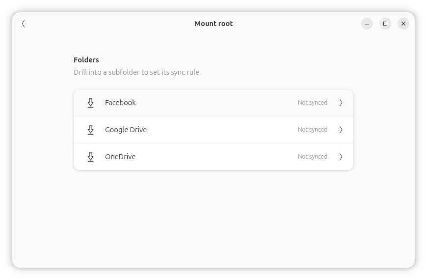
</p>

You start at the mount root. Each subfolder shows up as a placeholder until you drill into it for the first time — at which point the Manager runs a single-level placeholder expansion (it asks the agent for that folder's children, no actual file content downloaded yet). This *lazy expansion* keeps the initial mount near-instant: you only "pay" the metadata cost for folders you actually browse.

Drill into any folder and you'll see its sync-rule editor:

<p align="center">
  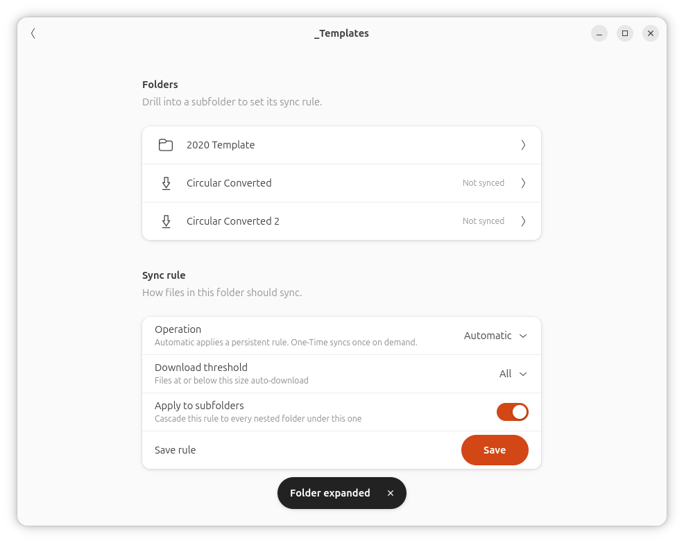
</p>

The **Sync rule** panel has four controls:

- **Operation** — *Automatic* (a persistent rule the agent re-applies as new content lands remotely) or *One-Time* (sync the folder right now, nothing persistent).
- **Download threshold** — the size cap for auto-downloading files in the folder. *None*, *Small (10 MB)*, *Medium (100 MB)*, *Large (500 MB)*, *All* (unlimited), or *Custom* (enter a number in MB). Files at or below the threshold get materialised; bigger files stay as `.cloud` placeholders.
- **Apply to subfolders** — when on, the rule cascades to every nested folder under this one. Off limits the rule to direct children.
- **Save** — pushes the rule to the agent (`odrive foldersyncrule`) *and* records it in the Manager's local SQLite so you can see and edit it later. Save bundles a one-time apply, so existing placeholders that match the rule materialise immediately rather than waiting for the next remote scan.

Once saved, the rule shows up on the main Mount & Sync tab:

<p align="center">
  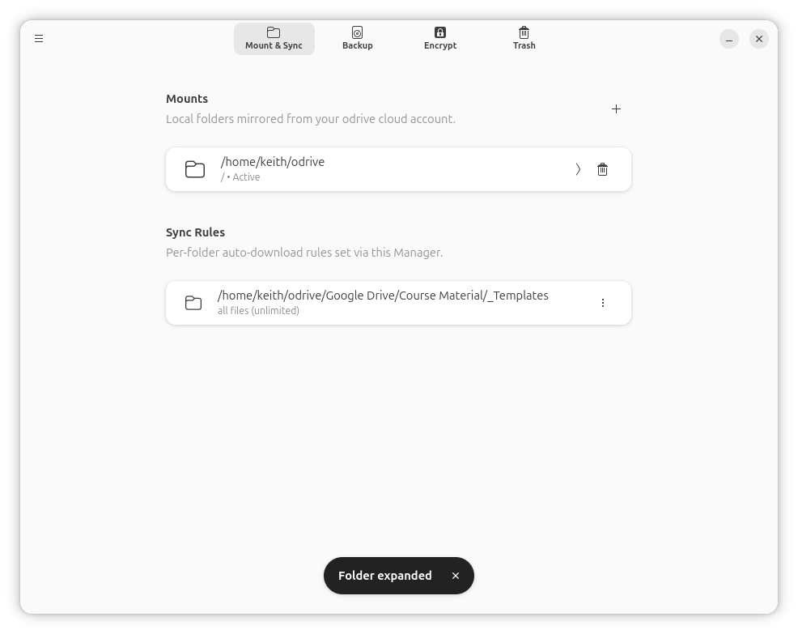
</p>

Click the row to jump back into the editor. The trailing "⋮" menu offers **Pause** (zero the threshold without losing the configured value), **Resume**, and **Delete**.

## Nautilus / Dolphin Integration

When a folder has an active sync rule, the file manager paints a **synced** emblem on it; while a sync is in flight, you'll see the **syncing** emblem instead. Both can be toggled per emblem under Preferences → Appearance.

| Emblem | Meaning |
|:---:|---|
|  | **Synced.** A folder with an active sync rule, or a regular file inside a mount. The rule promises this folder is being kept in sync. |
|  | **Syncing.** Sync is currently in flight on this path (the GUI marks it before kicking off `sync_recursive` and clears it on completion). |
|  | **Locked.** Reserved for upstream-locked files. The icon ships but isn't yet wired to a detection path. |

<p align="center">
  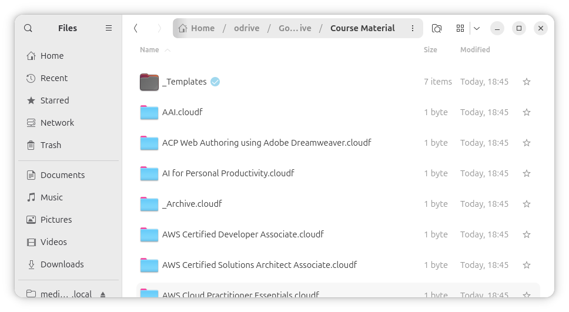
</p>

**Right-click any path under a mount** and the file manager surfaces an "Odrive ▸" submenu:

<p align="center">
  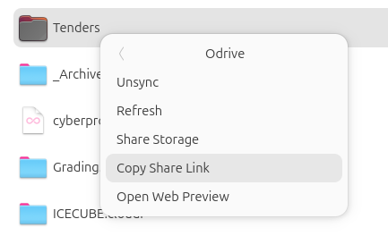
</p>

| Item | What it does |
|---|---|
| **Sync** *(if any selected entry is a placeholder)* | Materialises the placeholder. For folders this expands the placeholder one level, downloading actual files where the threshold permits. |
| **Unsync** *(if any selected entry is materialised)* | Reverts the local file/folder back to a `.cloud` / `.cloudf` placeholder, freeing disk space. |
| **Refresh** | Re-checks the remote for changes — handy when you know something changed cloud-side and want it reflected locally without waiting for the next scan. |
| **Share Storage** | Opens odrive's [Spaces](https://www.odrive.com/features/spaces) page in your browser. (Account-level, so the action ignores the selection.) |
| **Copy Share Link** | Asks the agent for a fresh share URL per selected item and copies the URLs (newline-joined) to the system clipboard. Each invocation generates a *new* URL — there's no upstream "fetch existing link" form. |
| **Open Web Preview** | Composes the path's odrive web-app URL and opens it in your browser. |

**Double-click** a `.cloud` placeholder anywhere — Files, Dolphin, the desktop — and it materialises on the spot then opens with the right default app. Same for `.cloudf` folders (the wrapper expands and opens).

## Backups

odrive's backup model is one-way local→remote, on a fixed 24-hour schedule. Modified files end up date-stamped in the destination, deduped against the most recent version. The Backup tab gives you:

<p align="center">
  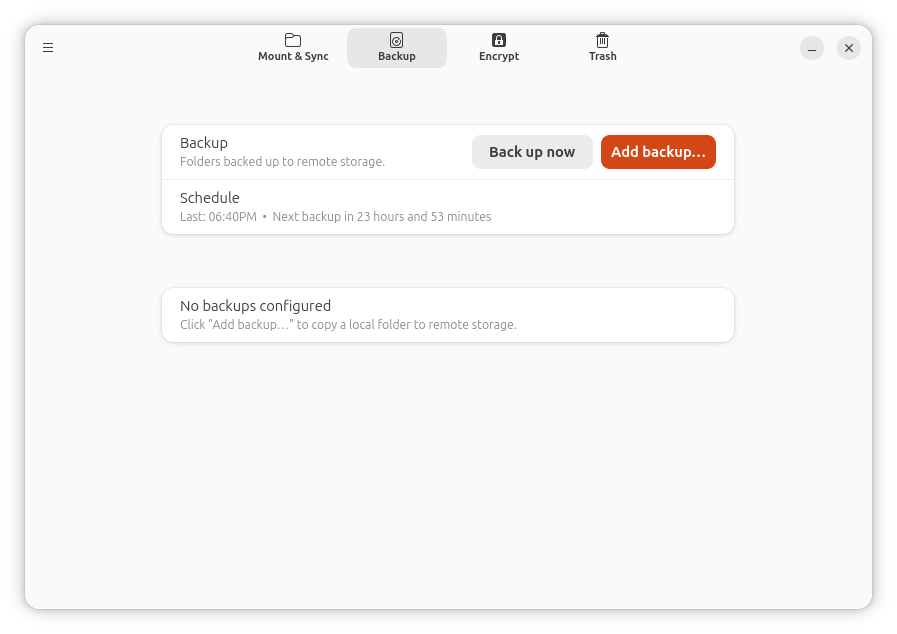
</p>

- **Back up now** — kicks off all registered backup jobs immediately (`odrive backupnow`).
- **Add backup…** — opens a modal where you pick a local source folder and type a remote destination path (the Manager doesn't browse remote storage — there's a "Manage on odrive.com" button in the dialog so you can copy the path from the web app).
- **Schedule** — shows the last completed run and a countdown to the next scheduled one. Pulled from the agent's IPC because the CLI strips those fields.
- **Per-job rows** — once you've added backups, each one gets a row with a small status caption, a button that opens odrive's web app for the destination, and a destructive **Remove** action.

There's no per-job force-run or per-job progress yet — neither the upstream CLI nor a public IPC exposes them.

## Encryption

odrive's Encryptor pairs a remote folder with a local zero-knowledge encrypted view. Files and filenames are encrypted client-side before upload; the agent decrypts them transparently while it's running and you've supplied the passphrase.

<p align="center">
  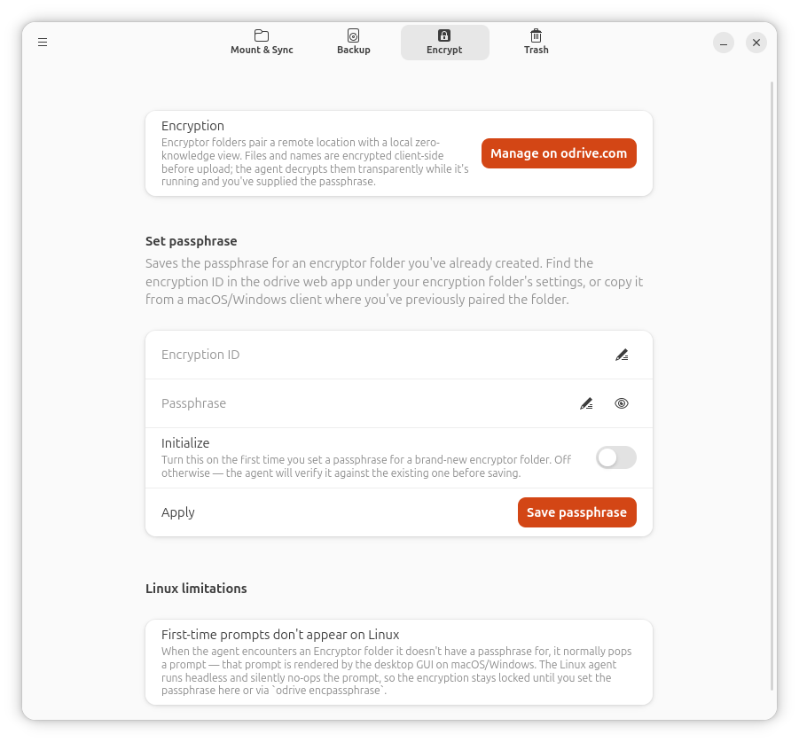
</p>

The tab is intentionally minimal because **creating** an Encryptor folder is a web-only operation (the CLI doesn't expose it). Use the **Manage on odrive.com** button to jump to the web app for that step.

Once a folder exists, the **Set passphrase** form binds your passphrase to the Encryption ID:

- **Encryption ID** — find this in the odrive web app under your encryptor folder's settings, or copy it from a macOS/Windows client where you've already paired the folder.
- **Passphrase** — the password you used (or want to use) for this folder's encryption.
- **Initialize** — turn this **on** the first time you set a passphrase for a brand-new encryptor folder. Off otherwise — the agent verifies the passphrase against the existing one before saving.

**Linux limitation:** the agent's "first-time-passphrase" prompt that the macOS/Windows desktop GUIs render automatically silently no-ops on the headless Linux agent. You have to set the passphrase here (or by running `odrive encpassphrase` directly) — there's no way for the Manager to discover an unconfigured Encryptor folder and prompt you mid-sync.

## Trash

odrive's trash holds items the agent has marked for deletion remotely. The Manager lists them so you can either Restore them as placeholders or empty the lot.

<p align="center">
  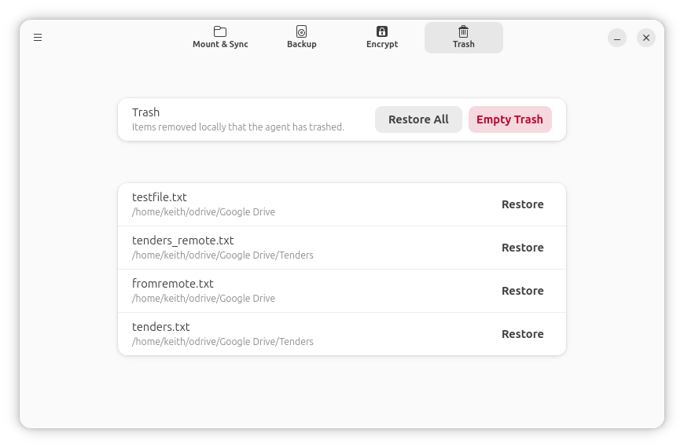
</p>

- **Restore All** — bulk restore. Everything currently in the trash comes back as placeholders.
- **Empty Trash** — bulk permanent delete (destructive — confirms first).
- **Restore** *(per row)* — only-restore-this-one. Implemented as a workaround because the upstream IPC has no per-item restore: the Manager captures the trash list, calls `restoretrash` (which restores everything as placeholders), then deletes the placeholder for every item the user did *not* pick. The agent's periodic local scan (~30 minutes) re-trashes those, so for a brief window the trash list will look empty even though only one item was actually restored. The 30-minute window is unavoidable from outside the agent.

## Tray Menu

The Manager registers a StatusNotifierItem icon while it's running (or — on Linux distros that ship the AppIndicator extension by default — both while it runs *and* when only the agent is up).

<p align="center">
  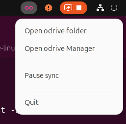
</p>

| Item | What it does |
|---|---|
| **Open odrive folder** | `xdg-open`s the first mount's local path. |
| **Open odrive Manager** | Presents (focuses / un-minimises) the Manager window. |
| **Pause sync / Resume sync** | Toggles the agent: stops it on Pause, starts it on Resume. The label and icon flip based on the agent's actual state, which the tray polls every 2 seconds. (This is a heavy-handed approximation — there's no upstream pause/resume that retains in-flight state. Documented as such, but the only available option until the upstream agent grows one.) |
| **Quit** | Closes the Manager. The agent keeps running (it's independent infrastructure managed by systemd-user); use Pause sync first if you want to stop it. |

The tray icon also **animates while transfers are in flight** — a 16-frame infinity loop in the colour you've picked under Preferences → Appearance — and goes still when the queues are empty.

# Preferences

All global configuration of the odrive agent happens here. Open it from the hamburger menu (top-left) → **Preferences**. The window is shaped like GNOME Settings: a sidebar lists sections, the right pane shows the active one. Changes apply immediately — no Save button.

## General

<p align="center">
  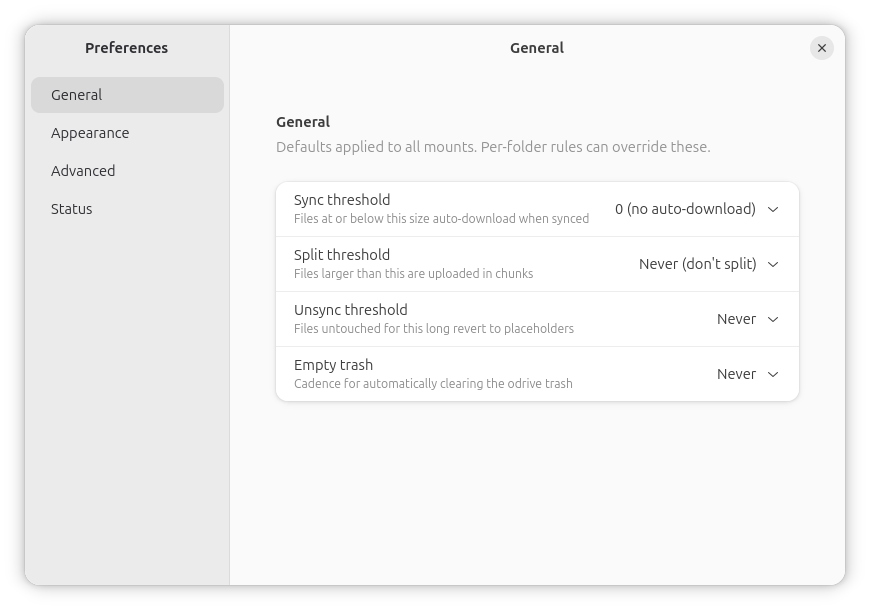
</p>

The four CLI-driveable thresholds, all defaults applied to every mount unless overridden by a per-folder rule:

- **Sync threshold** (`placeholderthreshold`) — files at or below this size are auto-downloaded when their parent folder is synced. Choices: *Never* (placeholder-only), *Small* (10 MB), *Medium* (100 MB), *Large* (500 MB), *Always*.
- **Split threshold** (`xlthreshold`) — files larger than this are split into chunks on upload. Choices: *Never*, *Small*, *Medium*, *Large*, *Extra Large*. Off by default — turn on if you upload single files in the multi-GB range.
- **Unsync threshold** (`autounsyncthreshold`) — files you haven't touched for this long automatically revert to placeholders, freeing disk. Choices: *Never*, *Day*, *Week*, *Month*. Premium-tier on the upstream side; the Manager surfaces the upstream error if your account doesn't support it.
- **Empty trash** (`autotrashthreshold`) — cadence for automatically clearing the odrive trash. Choices: *Never*, *Immediately*, *Fifteen minutes*, *Hour*, *Day*.

## Appearance

<p align="center">
  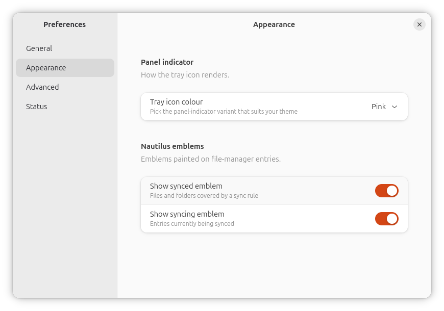
</p>

- **Tray icon colour** — pick the panel-indicator variant that suits your theme: *Pink*, *White*, *Black*, *Dark grey*, *Grey*. Changes take effect live (the running indicator re-renders without an app restart). Colours without a bundled animation set fall back to Pink frames for the active-state animation; the idle icon stays in your chosen colour.
- **Show synced emblem** — toggle the blue check on synced files / folders with rules.
- **Show syncing emblem** — toggle the pink rotating-arrows emblem on in-flight syncs.

The Nautilus extension reads both switches with a 1-second TTL cache, so flipping them takes effect within a directory tour and survives a Nautilus restart.

## Advanced

<p align="center">
  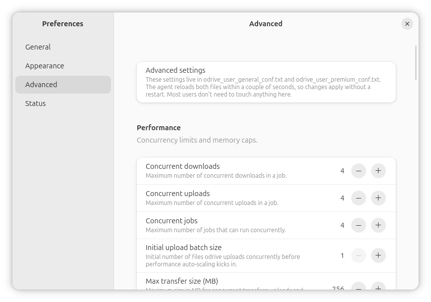
</p>

The file-based settings the agent reads from `odrive_user_general_conf.txt` and `odrive_user_premium_conf.txt`. Most users don't need to touch anything here. Settings group into:

- **Performance** — concurrency limits (downloads / uploads / jobs / initial upload batch), memory cap, chunk size, retry counts.
- **Schedule** — local scan, remote scan, and backup intervals (the upstream remote-scan floor is 5 minutes).
- **Notifications** — three suppression switches for the agent's built-in toast/notify behaviour.
- **Deletion** — `osTrashOverride` (3-option combo), and switches to disable local-item or remote-item delete propagation.
- **Encryption** — disable encrypted names, forget passphrase on shutdown, ignore the encryption hash check.
- **Diagnostic flags** — escape hatches with a strong "ask support before flipping these" caption.
- **Blacklists** — entry rows for `blackList{Contains,Extensions,Names,Prefixes}` and three corresponding *Remove* lists that subtract from the upstream defaults.

The agent polls both conf files on a ~2-second cadence and re-applies changes without a restart, so most edits in Advanced take effect within a couple of seconds.

## Status

<p align="center">
  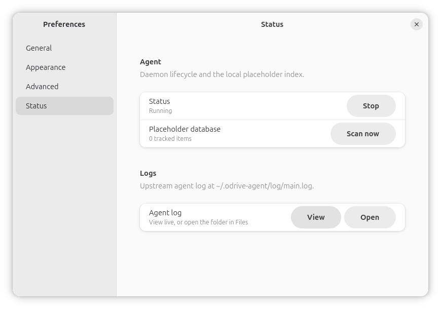
</p>

- **Agent** — Running / Stopped state with a Stop / Start toggle, and a Placeholder database row showing how many `.cloud` / `.cloudf` items the Manager has indexed. The **Scan now** button walks every mount and updates the index.
- **Agent log** — **View** opens a live colourised tail of `~/.odrive-agent/log/main.log` in a separate window (level-tinted: warnings orange, errors bold red, info default). **Open** shells `xdg-open` on the log directory so you can grab it for a bug report.

# Limitations

A few things the upstream agent doesn't expose, and that the Manager therefore can't fully replicate from macOS/Windows:

- **No "Share Link" with permission / expiry / password configuration.** The macOS/Windows desktops show odrive's web sharing dialog before generating the URL; that flow needs the agent's session token, which lives only in the SEE-encrypted (Hipp/Wyrick AES-256) `~/.odrive-agent/db/odrive.db`. SQLCipher and other open-source SQLite encryption tools are binary-incompatible with SEE — verified by symbol inspection. The Manager offers **Copy Share Link** (one-shot URL via the CLI's `sharelink`) and **Open Web Preview** (path → web URL) instead.
- **No per-item Trash restore in the upstream IPC.** Confirmed by decompiling `ProtocolCommands.pyc` (`RESTORE_TRASH = 'restoretrash'` is the only restore command, takes no parameters) and probing the live socket. Per-item restore is faked via a "restore-all-then-redelete-the-rest" workaround, which means there's a ~30-minute window where the trash list looks temporarily empty. **Empty Trash** is per-item too, but only as part of a bulk action — there's no per-item permanent delete.
- **No native pause/resume.** Pause stops the agent (killing in-flight transfers); Resume starts it again. The only available option until the upstream agent grows a real pause/resume verb.
- **No upstream LIST or REMOVE for `foldersyncrule`.** The agent only accepts the setter form. The Manager keeps its own SQLite table (`folder_sync_rules`) so the GUI can render existing rules; "Delete" sets the threshold to `0` (≡ never auto-download) and drops the row. Rules set via `odrive foldersyncrule` directly (without going through the Manager) are invisible to us.
- **No reliable premium-tier indicator.** `odrive status` doesn't expose one; the Manager doesn't gate any UI on premium status. If you set a premium-only feature on a free account, you'll see the upstream error as a toast.
- **Encryptor folder ID lookup is blocked by the SEE wall.** `encryptionEntriesPropertyList` lives only in `get_dev_system_status_items` (a dev-only IPC variant). You have to grab the ID from the odrive web app or from a macOS/Windows client.
- **First-time encryptor passphrase prompts don't render on Linux.** The headless agent's prompt method is a no-op; set the passphrase explicitly via the Encrypt tab or `odrive encpassphrase`.
- **No per-job backup force-run or progress.** Neither the CLI nor the IPC exposes them; the only way to push backups is **Back up now** (which runs *all* jobs).
- **No "Open in Google Docs / OneNote" deep link** for `.gdoc.cloud` etc. — same SEE wall (`/rest/link/get_open_url`).

# DISCLAIMER

odrive-linux is an **unofficial** Linux frontend. This project is **not affiliated with, endorsed by, or sponsored by Oxygen Cloud, Inc.** or their odrive product. "odrive" is a registered trademark of Oxygen Cloud, Inc.

This program is distributed in the hope that it will be useful, **but WITHOUT ANY WARRANTY**; without even the implied warranty of MERCHANTABILITY or FITNESS FOR A PARTICULAR PURPOSE. See the GNU Affero General Public License version 3 for more details. The full license text is in [LICENSE](LICENSE); the project is distributed under **AGPL-3.0-or-later**.

You assume all risk for the use of this software. The authors and contributors are not responsible for any data loss, corruption, account suspension, or any other damage arising from its use. Always keep independent backups of important data.
